1: instructions
/init do this when you use claude for the first time on your project, so it will scan the full codebase, and will generate a caude.md contain summary about the repo. Each time you create a prompt, claude.md is also send as context. You can modify this file if you want for example "only use comments for complex code".
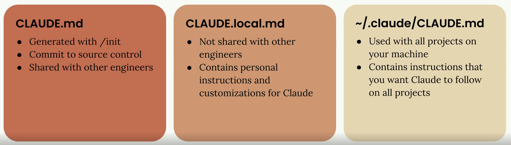

2: context
As described in point 1, claude.md is used as context in each prompt. But you can also tag a file in the prompt using "@".  You can also use the "@" to reference a file to the claude.md: 
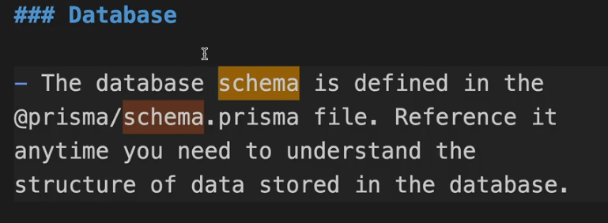

3: Planning mode
For more complex tasks that require extensive research across your codebase, you can enable Planning Mode. This feature makes Claude do thorough exploration of your project before implementing changes.

Enable Planning Mode by pressing Shift + Tab twice (or once if you're already auto-accepting edits). In this mode, Claude will:

Read more files in your project
Create a detailed implementation plan
Show you exactly what it intends to do
Wait for your approval before proceeding

3: Thinking mode
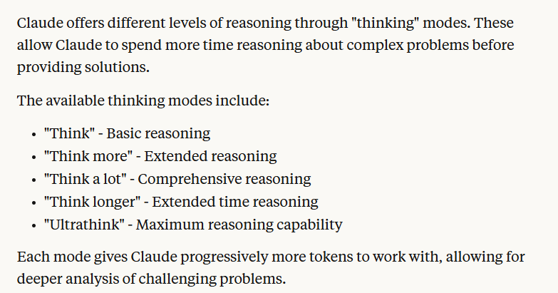

4: When to use planning vs thinking
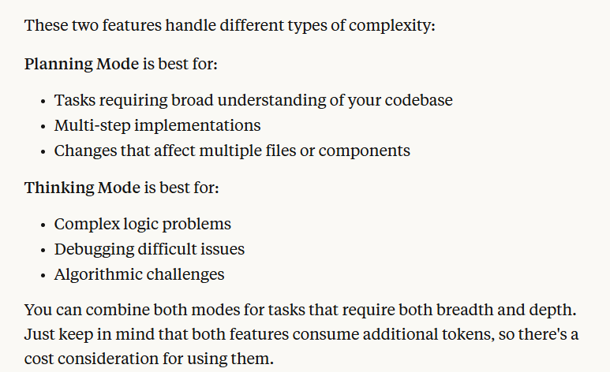

5: Tests
Prompt: Write tests for the file @controllerAnything.cs file

6: Interrupt with ESC
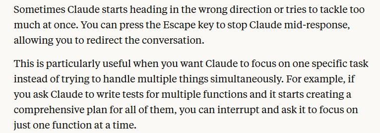

7: Commands
/compat = Clear conversation history but keep a summary in the context.
/clear = Dump conversation history. Youll use this if you want to start a new unrelated task, so  that it has a new empty context.
/mcp = to check what mcp servers are setup.

8: Custom commands
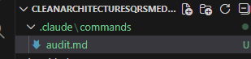
Create .claude folder in root project, and use the dash "/" and then the name of the file, its easy as that. Now you have a reusable command.

9: MCP
    - Popular MCP: playwright. Gives claude code abbility to control a browser.
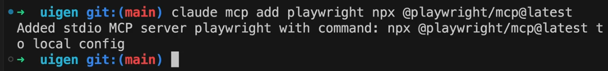
Playwright is just one example of what's possible with MCP servers. The ecosystem includes servers for:

Database interactions
API testing and monitoring
File system operations
Cloud service integrations
Development tool automation
Consider exploring MCP servers that align with your specific development needs. They can transform Claude from a code assistant into a comprehensive development partner that can interact with your entire toolchain.

10: Hooks

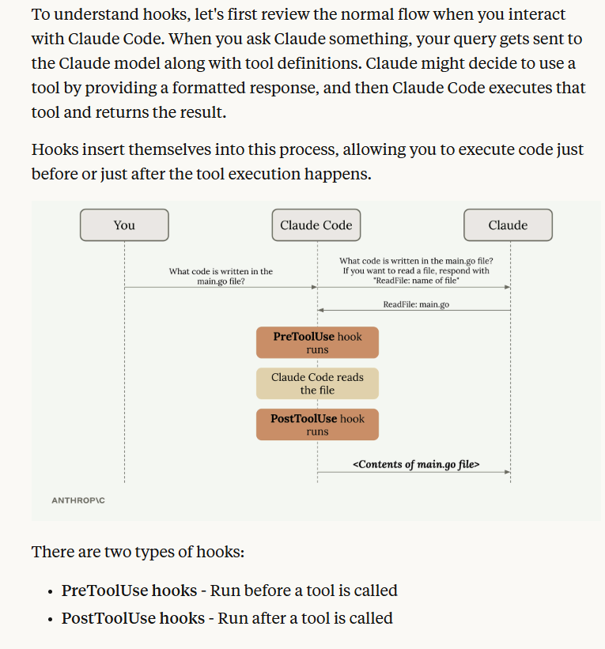

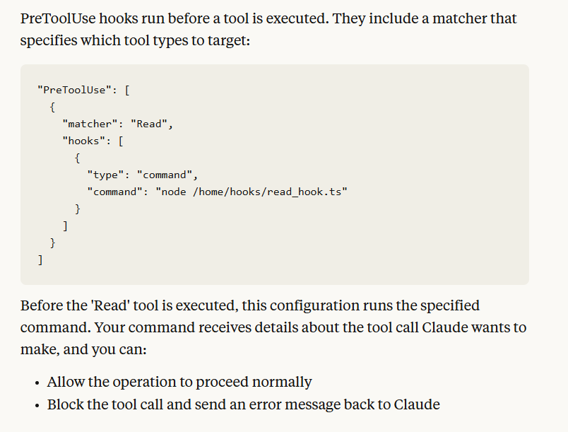

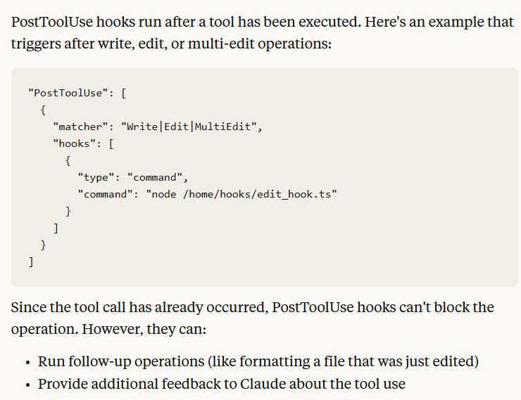

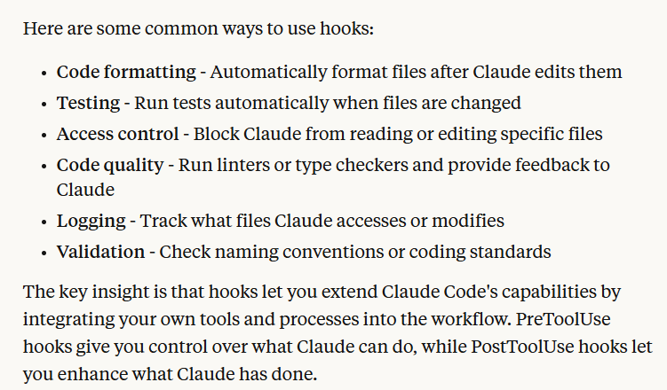
